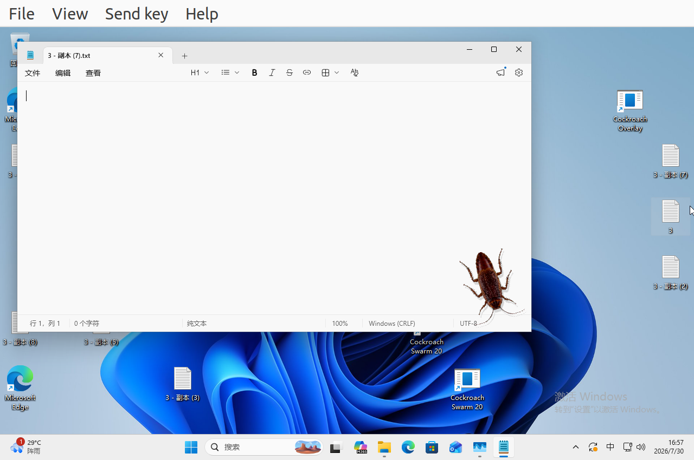

# Awesome Bug

[](https://github.com/tiansongyu/awesome_bug/actions/workflows/windows-package.yml)

一个 Windows 11 桌面宠物框架：Rust 负责安全、碰撞、SDL2 渲染和 Win32
集成，Lua 负责虫子的全部行为。仓库自带一只具有独立六足、双触须和真实移动
节奏的蟑螂，以及可复制的新物种模板。



> 当前只发布 Windows x64 桌面程序。Linux 可运行无窗口核心测试，但不提供
> Linux 桌面应用。

## 已实现机制

- Lua FSM 管理 `wander`、`creep`、`pause`、`startled`、`flee`、
  `seek-corner`、`lurk`、`groom`、`seek-food` 和 `feeding`。
- 快速巡游为主，穿插慢速移动、停顿、速度脉冲和身体微摆。
- 鼠标快速接近或进入警戒范围时，蟑螂受惊并加速逃跑。
- 单只模式会在屏幕角落潜伏；身体静止时触须仍探测，并周期性清洁触须。
- `Ctrl+Alt+F` 在鼠标位置投放食物；食物位于桌面/普通窗口之上、蟑螂之下。
- 六条腿独立绘制并采用交替三足步态；两根触须具有不同相位和状态姿态。
- 身体使用定向包围盒避开 Explorer 图标和文字；腿、触须不参与碰撞。
- 拖拽图标时主动远离。被图标覆盖或夹住时逐帧脱困，不跨屏瞬移、不长期卡住。
- 按显示器物理分辨率动态缩放，支持负坐标多显示器和 Per-Monitor V2 DPI。
- 窗口背景透明、虫体保持不透明；覆盖层点击穿透、始终置顶且不抢键盘焦点。
- 单只与 20 只版本共用同一运行时；20 只拥有独立体型、位置、姿态和随机流。
- `--seed`、`--frames`、`--trace` 支持确定性复现和自动验证。

## 快速使用

从 [Windows x64 package CI](https://github.com/tiansongyu/awesome_bug/actions/workflows/windows-package.yml)
下载构建产物中的 Windows x64 ZIP，完整解压后运行：

```text
cockroach_overlay.exe       单只桌面宠物
cockroach_swarm_20.exe      默认 20 只
```

请保持 EXE、`SDL2.dll` 和 `bugs/` 的相对位置不变。资源路径锚定到 EXE，
因此可从任意工作目录启动。

热键：

| 热键 | 作用 |
| --- | --- |
| `Ctrl+Alt+F` | 投放或移动食物（单只模式） |
| `Ctrl+Alt+Q` | 退出 |

常用参数：

```text
--species ID          使用 bugs/ 下的物种包
--species-path DIR    使用指定物种目录
--asset PATH          覆盖兼容 atlas
--size N              固定身体长度，100..520 像素
--speed N             速度倍率，0.25..3；默认 3
--display N           显示器序号
--count N             实例数，1..50
--seed N              固定主种子
--no-click-through    调试时接收鼠标输入
--frames N            N 帧后退出
--trace PATH          输出 TSV 帧轨迹
--help                查看帮助
```

示例：

```powershell
.\cockroach_overlay.exe --size 200 --seed 42
.\cockroach_swarm_20.exe --count 20
.\cockroach_overlay.exe --species template
```

## 架构

```text
Windows / Explorer / input
            │
            ▼
bug-windows: SDL2 + Win32 host
            │  strict frame contract
            ▼
bug-runtime: Lua sandbox + RNG + OBB solver + rig
            │
            ▼
bugs/<species>/{manifest.lua, behavior.lua, atlas.png}
```

边界保持简单：

- Lua 决定状态、目标、速度、转向、恢复策略和所有肢体姿态。
- Rust 验证输入输出，执行屏幕/图标硬约束，并生成 renderer-neutral draw plan。
- Win32 层只处理显示器、Explorer、输入、窗口和 Z-order。
- 脚本出错时仅隔离对应实例，保持最后有效姿态并安全静止；没有第二套 Rust
  行为 fallback。

Lua 5.4 运行在 32 MiB 内存和每次调用 100,000 指令的预算中。脚本没有文件、
网络、进程、动态模块、调试或内建随机数权限；唯一熵源是带 tag 的宿主 RNG。
每个实例都会在新的 sandbox environment 中求值行为和 FSM，模块局部变量也不
会在多只虫子之间共享。

完整设计见 [Rust + Lua 运行时设计](docs/rust-lua-runtime-design.md)。

## 添加新虫子

复制 `bugs/template/`，修改三个文件：

```text
bugs/my_bug/
  manifest.lua     atlas、身体碰撞体、部件、层级和能力
  behavior.lua     ABI v1 controller、FSM、运动和姿态
  atlas.png        透明 RGBA atlas
```

随后运行：

```powershell
.\cockroach_overlay.exe --species my_bug
```

宿主没有蟑螂专用状态，也不要求 native subclass 或主循环修改。模板说明见
[`bugs/template/README.md`](bugs/template/README.md)。

## 构建

工具链固定在 Rust 1.97.1，SDL2 固定在 2.32.10 并校验下载 SHA-256。

Windows MSVC 需要 PowerShell 7（`pwsh`）以及 Visual Studio 2022 Build Tools
中的“使用 C++ 的桌面开发”和 Windows SDK：

```powershell
rustup target add x86_64-pc-windows-msvc --toolchain 1.97.1
pwsh -File .\scripts\build-windows-msvc.ps1
```

Ubuntu 交叉编译 Windows GNU：

```bash
rustup target add x86_64-pc-windows-gnu --toolchain 1.97.1
sudo apt install gcc-mingw-w64-x86-64 binutils-mingw-w64-x86-64 \
  curl zip
./scripts/build-windows.sh
```

默认 GNU 流程运行 native core 测试、交叉链接检查并生成：

```text
dist/cockroach-overlay-windows-x64.zip
dist/cockroach-overlay-windows-x64.zip.sha256
```

可选 `--wine-smoke`。旧 Wine 可能缺少现代 Rust Windows 程序使用的
`bcryptprimitives.dll`；Windows 11 VM 和 MSVC CI 是正式运行门槛。

## 测试

无窗口核心：

```bash
cargo fmt --all --check
cargo clippy -p bug-runtime --all-targets --locked -- -D warnings
cargo test -p bug-runtime --locked
cargo clippy -p bug-windows --lib --locked -- -D warnings
cargo test -p bug-windows --lib --locked
```

测试集包括严格 manifest/ABI、Lua sandbox、Tagged RNG、身体 OBB、连续碰撞、
对称图标夹缝、rig、2,400 帧迁移锁步和 100,000 帧压力测试。

Windows 11 VM smoke 会运行单只 360 帧和 20 只 × 120 帧，检查实例数、
quarantine、最大单帧位移和产物 SHA。VM 工具见
[`vm/windows11/README.md`](vm/windows11/README.md)。

## 许可

代码与项目自有文本采用 [MIT License](LICENSE)。

蟑螂 raster 美术的上游作者、URL 和授权未被记录，因此不包含在 MIT 授权中；
使用和再分发前请阅读 [ASSET-NOTICE.md](ASSET-NOTICE.md)。第三方软件许可随
Windows 包一并提供。
